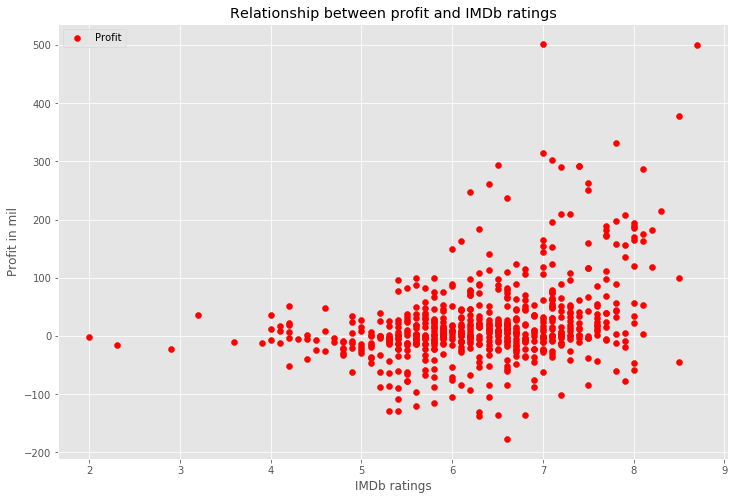
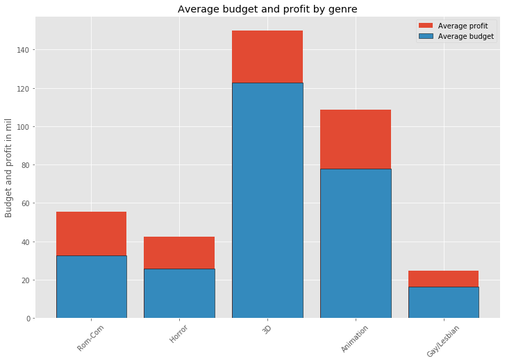
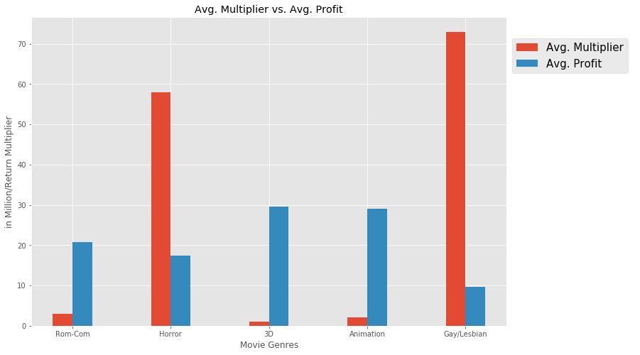

# Movie Analysis on Different Genres and Profitability
Contributors: Jay Kim, Jon Bebi, and Marco Santos

## Task:
Film ideas for a prospective movie studio, given:
 * Industry Landscape
 * SWOT Analysis
 * Current Trends
Findings evidenced by Graphs & Tables

## Applications Utilized:
Data Science Tools Used:
 * GitHub
 * Jupyter Notebook (Python)
 * MySQL
 * Beautiful Soup
 * Matplotlib

Websites Used:
 * Box Office Mojo (webscraping): $ metrics
 * IMDb (API): user ratings
 * The Numbers (webscraping): bankability of top industry figures

## How a movie's success is measured
A films success is dependant on multiple factors:
 * User Reviews
 * Box Office Performance
 * Returns relative to the budget
 
The following information presents discoveries showing which factor is most important when determining a film's profitability.
## Genres examined:
* 3D
* Animation
* Gay/Lesbian
* Horror
* Rom-Com

These genres were found from BoxOfficeMojo sorted by quantity of movies.  The other two genres ahead of the ones selected were Foreign Language and Documentary which were eliminated based on lack of overall mainstream success.

## MySQL Database schema with movies collected
Collected 715 Movies from BoxOfficeMojo and here it is being displayed as a summary table.  These movies were released beginning from 1980 to the present, which were as far back as the data collected from BoxOfficeMojo would allowed.  The selected attributes from each film were uploaded using Python's MySQLconnector and the necessary query commands.

(Insert mysql html image here)

## Data Collected and Visualized
The data gathered from both the-numbers.com and boxofficemojo.com were scraped using Python's Beautifulsoup library to parse through each website's HTML code.  An API key from OMDb, a third-party, through Python was used to gather the required user reviews from IMDb.com. The data was then visualized into various graphs and charts using Python's Matplotlib library.

## Correlation between profit and ratings

A positive correlation is expected to have the scatter plot dots increasing from the left to right forming a gradual slope upwards. Based on the data the results appears to be a nearly flat slope.  This displays no significant correlation between user reviews and box office revenue.

## Average budget and profit by genre

For the genres of Rom-Com, Horror, and Gay/Lesbian the average profit is almost half of the average budget used. The average budget for this genres is relatively much lower than 3D and Animation.

## Average Multiplier vs. Average Profit

The average multiplier is simply calculated as the box office returns divided by the budget, showing how much return is expected on average given a movie's genre.  Even though the average profit return is nearly half of the average budget for Rom-Com, Horror, and Gay/Lesbian films; the profit gross is still not as high as the 3D or Animation genres.

This bar chart displays the multiplier vs the return and it can be observed that the Gay/Lesbian and Horror films have the best multiplier.  However, their respective profit does not return as much as the 3D and Animation genres.

## Histogram Distribution of Profitable Films across each Genre

When it comes to the overall probability to making profitable movies, the likelihood a film studio can actually make a profit is shown above.  Most films across the genres are more likely to either break-even or lose money.  Only a few movies are able to make a decent profit in the film industry.

## Recommendations and Suggestions

Based on the visualized data, the recommended route for a brand new movie studio is to focus primarily on Gay/Lesbian themed movies or Horror films.  Both of these genres provide a decent amount of profit without the large budget commitment a 3D or Animation movie requires.  Although, if a new film studio wanted to make a large profit, break the box office, and has no issue with investing a large amount of money in a film; it is recommended to focus on a 3D or Animation movie involving a well-known, reputable industry professional.  At the very least, involve a famous actor/actress, or producer/director in a film in order to increase the chances of making a profit.  However, based on the distribution of profitable movies across the genres, it is suggested to not enter the film industry at all because there is a larger chance of not making a profit at all.
